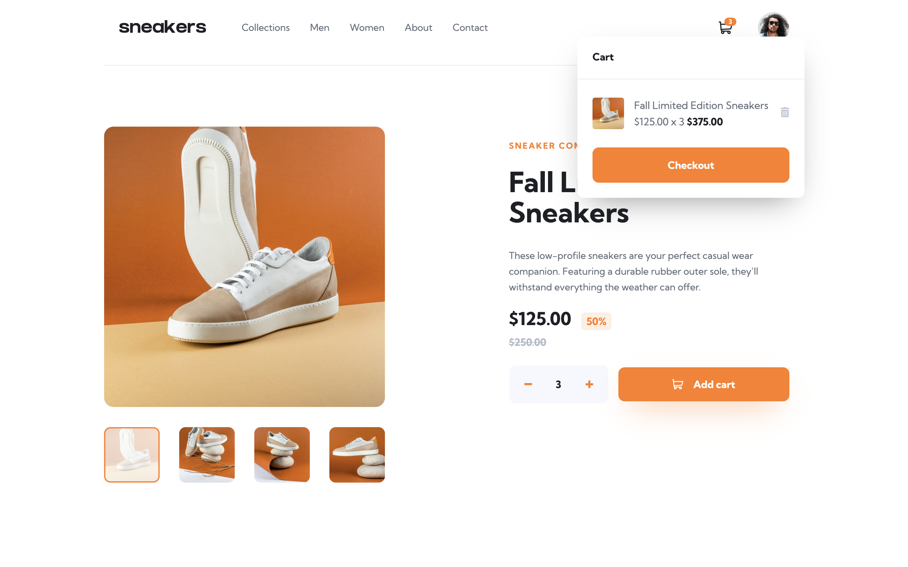
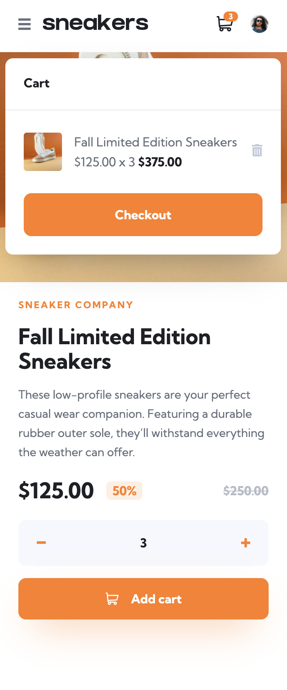

# Frontend Mentor - E-commerce product page solution

This is a solution to the [E-commerce product page challenge on Frontend Mentor](https://www.frontendmentor.io/challenges/ecommerce-product-page-UPsZ9MJp6). Frontend Mentor challenges help you improve your coding skills by building realistic projects.

## Table of contents

- [Overview](#overview)
  - [The challenge](#the-challenge)
  - [Screenshot](#screenshot)
  - [Links](#links)
- [My process](#my-process)
  - [Built with](#built-with)
- [Author](#author)

## Overview

### The challenge

Users should be able to:

- View the optimal layout for the site depending on their device's screen size
- See hover states for all interactive elements on the page
- Open a lightbox gallery by clicking on the large product image
- Switch the large product image by clicking on the small thumbnail images
- Add items to the cart
- View the cart and remove items from it

### Screenshot
* Desktop (page/cart/lightbox)

* Mobile (page/menu/cart)

### Links

- Solution URL: [E-commerce Product Page using NextJS](https://www.frontendmentor.io/solutions/ecommerce-product-page-using-nextjs-_JIZF0o63)
- Live Site URL: [Ecommerce Product Page](https://ecommerce-product-page-hanseonglee.vercel.app)

## My process

### Built with

- Semantic HTML5 markup
- CSS custom properties
- Flexbox
- CSS Grid
- Mobile-first workflow
- [Context](https://reactjs.org/docs/context.html) - For global state managements
- LocalStorage - For global state store
- [React](https://reactjs.org/) - JS library
- [Next.js](https://nextjs.org/) - React framework
- [Sass/SCSS](https://sass-lang.com/) - For styles
- [next-themes](https://github.com/pacocoursey/next-themes/) - For themes

## Author

- Frontend Mentor - [@HanSeongLee](https://www.frontendmentor.io/profile/HanSeongLee)
